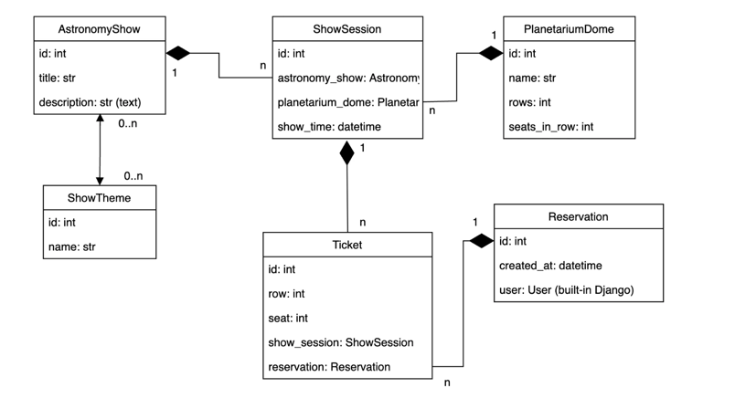
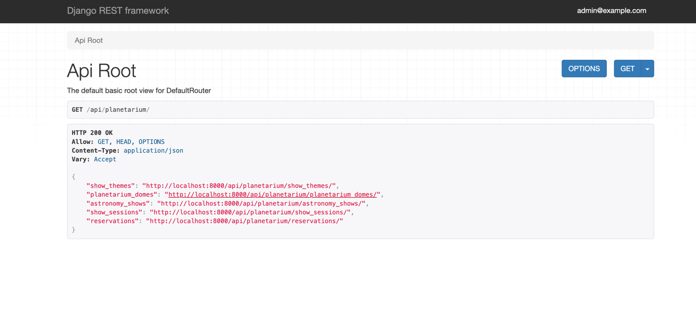

# Planetarium Service

API service for Planetarium management written on DRF

## Check it out!

For login use following login and password:
* Email: `admin@example.com`
* Password: `12345`


## Installation using GitHub

For beginning you have to install Python3+, PostgresSQL and create db

In terminal write down following command:
```shell
git clone https://github.com/juliastetsko/planetarium.git
cd cinema_API
python -m venv venv 
source venv/bin/activate 
pip install -r requirements.txt
export DB_HOST=<your db hostname>
export DB_NAME=<your db name>
export DB_USER=<your db username>
export DB_PASSWORD=<your db user password>
export SECRET_KEY=<your secret key>
python manage.py migrate
python manage.py runserver


```
## Run with docker

Docker should be installed
```shell
docker-compose build
docker-compose up

```
## Getting access

```shell
• create user via /api/user/register/
• get access token via /api/user/token/
```

## Features
```

Planetarium Dome: This section oversees information about planetarium domes, encompassing their names,
the number of rows, and the seating capacity per row.

Astronomy Show: This component manages data related to astronomy shows, including titles,
descriptions, and themes.

Show Session: This facilitates the scheduling of show sessions within planetarium domes.
It involves specifying the astronomy show, date, and available seat count.

Reservations: Users can make reservations for show sessions, selecting seats within the dome.

User System: This system facilitates the creation of user profiles, updating user information,
and the differentiation of users based on their permissions or rights.
```

## Database Structure


## Home page


